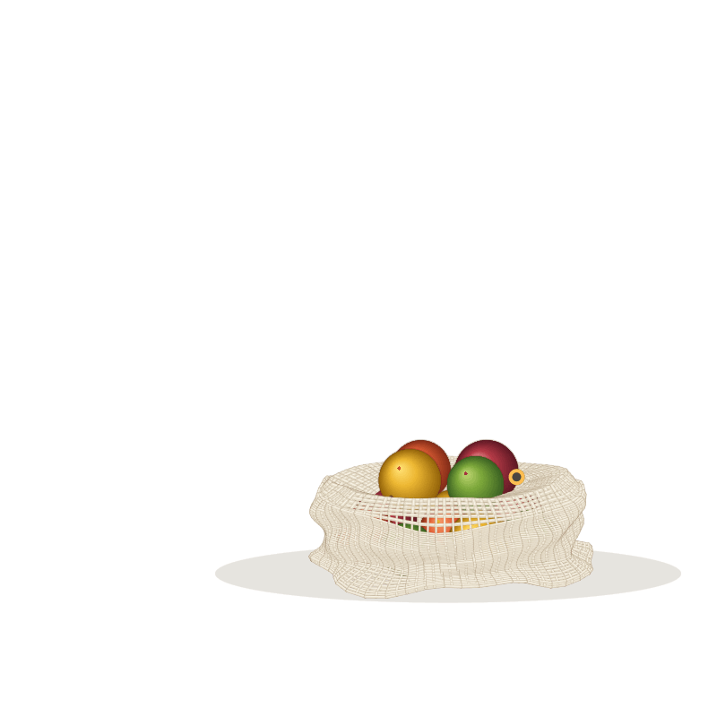
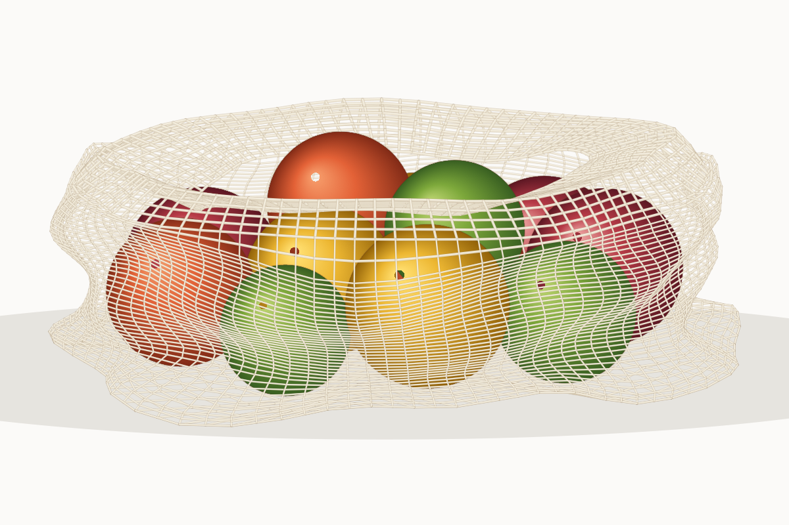
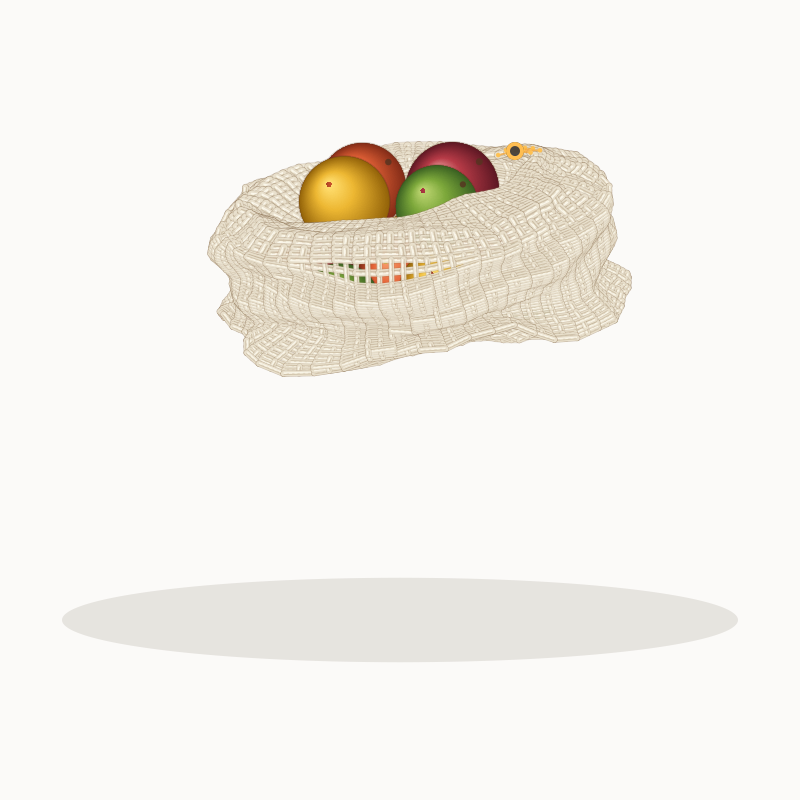
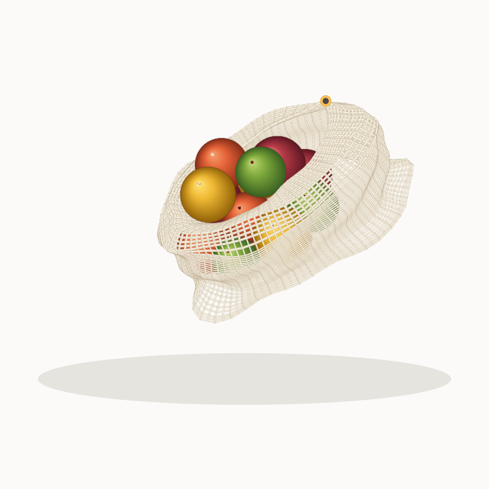
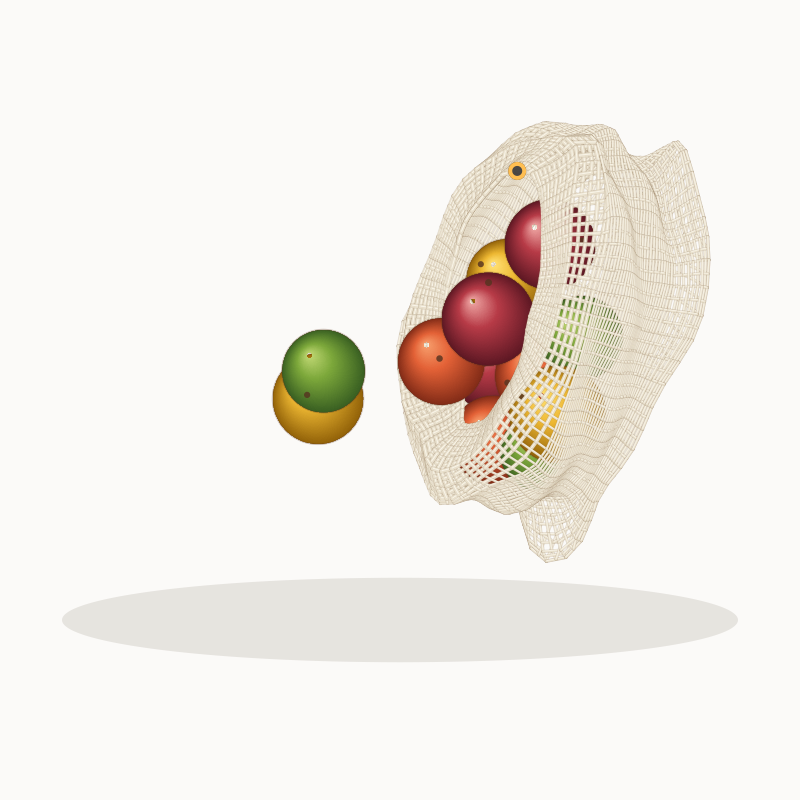
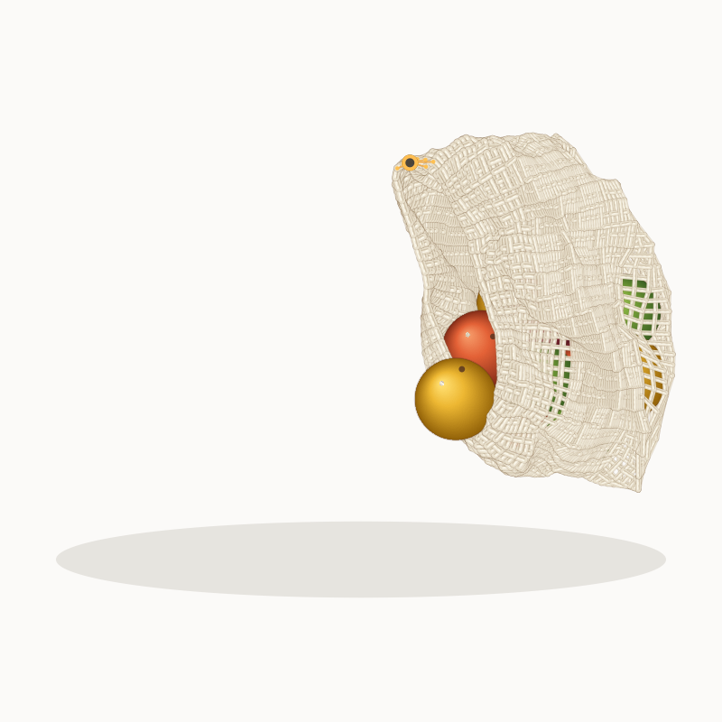

# Numi Solver

Numi Solver is the independent Apple Metal home of the Temporal Cone contact
solver extracted from Numi Lab's `numisolver` branch.

This repository intentionally contains only the owning Metal solver source and
its pointer-free GPU ABI headers. It does not contain Numi Lab's robot models,
training runtime, tasks, applications, research artifacts, rendering runtime,
or website. Files under `docs/assets` are generated solver evidence, not an
application scene.

## Pick up the bag and spill the fruit



This looping GIF contains 25 fixed-camera frames from one 1.2-second solver
trajectory. The orange ring is the only kinematic cloth vertex: the other 1,344
cloth particles and all twelve fruits remain dynamic. The bag starts resting on
the plane, rises under the one-point grip, tips, and releases fruits 9, 10, and
11. Two have landed by the final frame while the third is still falling.

The replay passed every mechanics gate with `released_mask=3584`,
`escaped_mask=0`, `0.253701462` maximum warp extension,
`0.073779296` maximum shear strain, and bit-identical state hash
`0x2ee3fa9d255230cb`. The GIF is rasterized from those exported states; it is
CPU FP64 cloth evidence, not Metal-performance or Temporal Cone cloth-contact
evidence.

## Grounded cloth produce-bag replay



This PNG is rasterized directly from the actual deterministic FP64 solver state;
it is not concept art or a hand-posed scene. The replay advances a free 48 by 28
cloth control surface and twelve dynamic fruit spheres for one second. The
AppKit rasterizer adds cotton-fiber strokes between control points but does not
move the exported state.

The qualified replay passed with no escaped or spilled fruit, no collapsed
triangles, `0.004774631 m` maximum fruit/cloth penetration,
`0.002980520 m` maximum vertex self-penetration, and bit-identical replay hash
`0xe4e38a3f34b0645f`. This is CPU FP64 cloth evidence, not Metal-performance or
Temporal Cone cloth-contact evidence.

### Grab one rim point and spin

The orange ring marks the one kinematic rim vertex. Every other cloth node and
all twelve fruits remain dynamic. These five fixed-camera frames come from one
0.5-second trajectory; they are not separately posed simulations.

| `t=0.000 s` | `t=0.125 s` | `t=0.250 s` |
|:--:|:--:|:--:|
|  |  |  |

| `t=0.375 s` | `t=0.500 s` |
|:--:|:--:|
|  |  |

The spin replay passed with `0.115408315` maximum warp extension,
`0.053911317` maximum shear strain, zero numerical escapes, and bit-identical
hash `0x99db40bd86feb817`. `released_mask=3584` records fruits 9, 10, and 11
leaving the open mouth; the images and the outcome metric agree.

Reproduce the README image from the executable state:

```sh
./build/numi-solver-cloth-bag \
  --scenario grounded --steps 120 --substeps 4 --iterations 12 \
  --dump-obj build/cloth-produce-bag-1s.obj

swift tools/render_cloth_obj.swift \
  build/cloth-produce-bag-1s.obj docs/assets/cloth-produce-bag.png

./build/numi-solver-cloth-bag \
  --scenario spin --steps 60 --substeps 4 --iterations 12 \
  --dump-frames build/cloth-spin

for step in 0 15 30 45 60; do
  swift tools/render_cloth_obj.swift \
    "build/cloth-spin-${step}.obj" "docs/assets/cloth-spin-${step}.png"
done

./build/numi-solver-cloth-bag \
  --scenario pickup --steps 144 --substeps 4 --iterations 12 \
  --dump-frames build/cloth-pickup --dump-every 6

mkdir -p build/cloth-pickup-png
for step in $(seq 0 6 144); do
  swift tools/render_cloth_obj.swift \
    "build/cloth-pickup-${step}.obj" \
    "build/cloth-pickup-png/frame-${step}.png" pickup
done

swift tools/compose_cloth_gif.swift \
  docs/assets/cloth-pickup-spill.gif 0.05 \
  $(for step in $(seq 0 6 144); do
    printf '%s ' "build/cloth-pickup-png/frame-${step}.png"
  done)
```

## Solver boundary

The initial `src/metal/MetalWorldContact.metal` import was preserved
byte-for-byte from the source revision recorded in
[PROVENANCE.md](PROVENANCE.md). Independent development is tracked from that
snapshot. The file owns the complete contact pipeline required by Temporal
Cone, including deterministic island and tile construction, Wave8/16/32 cohort
selection, coupled normal/tangent cone updates, distributed-island reduction,
stiff-island ordered replay, warm-start publication, and transactional status
reduction.

The solver still speaks the original versioned MetalWorld ABI. Narrow,
pointer-free ABIs expose its local cone mathematics, packed contact islands,
response-column assembly, and rigid-body response/publication path. They call
the production Metal helpers; they do not carry a second shader
implementation.

## Build

Requirements:

- Apple Silicon macOS
- CMake 3.28 or newer
- Xcode/Command Line Tools with Metal 4 support

```sh
cmake -S . -B build -G Ninja
cmake --build build
```

The build produces `build/shaders/NumiTemporalCone.metallib` using `-O3` and
`-fno-fast-math`, plus ten native harnesses:

- `build/numi-solver-math` for isolated local cone blocks;
- `build/numi-solver-islands` for dense-versus-streamed coupled
  1/2/4/8/16/32-contact islands;
- `build/numi-solver-assembly` for GPU response-column assembly followed by
  a streamed solve on one command buffer.
- `build/numi-solver-rigid` for rigid contact frames and mass/inertia through
  deterministic velocity publication on one command buffer.
- `build/numi-solver-braided-bag` for an end-to-end deformable braided bag
  containing six falling balls, with matched dense and streamed trajectories.
- `build/numi-solver-cloth-bag` for a deterministic FP64 dense-cloth reference
  with a free folded rim, stretch/shear, soft dihedral bending, twelve-fruit
  contact and friction, ground contact, vertex self-collision, and a one-point
  airborne spin scenario. This is a CPU reference, not Metal-performance
  evidence.
- `build/numi-solver-articulated` for canonical articulated mass/Jacobian
  factorization, response-column solves, cone contact, and deterministic
  generalized-velocity publication on one command buffer.
- `build/numi-solver-articulated-capacity` for the complete 32-DoF,
  32-contact, 1,024-block articulated frontier and the complete admitted
  streamed inverse-ABA transaction.
- `build/numi-solver-articulated-conditioning` for deterministic rejection
  and rollback of forward-inaccurate ill-conditioned mass response.
- `build/numi-solver-articulated-zero-armature` for explicit rejection of an
  inverse response with no positive armature lower bound.

Run the default FP64 comparisons and deterministic replays:

```sh
./build/numi-solver-math
./build/numi-solver-islands
./build/numi-solver-assembly
./build/numi-solver-rigid
./build/numi-solver-braided-bag
./build/numi-solver-cloth-bag
./build/numi-solver-articulated
./build/numi-solver-articulated-capacity
./build/numi-solver-articulated-conditioning
./build/numi-solver-articulated-zero-armature
ctest --test-dir build --output-on-failure
```

The local harness accepts `--cases N --replays N --iterations N` and
`--isotropic`. The island, assembly, rigid, and articulated harnesses accept
`--islands N` and `--replays N`. The bag accepts `--environments N`,
`--steps N`, `--replays N`, `--timestep DT`, optional `--refinement`,
`--preset baseline|stiff-braid|low-cfm|high-friction`, and optional
`--dump-obj PATH`. Together they
check separating, impact, sticking, sliding,
anisotropic friction, near-rank-deficient response, capped impulse, polar
boundary, exact one-axis friction, extreme scale, sparse topology, full block
capacity,
shared response, missing coupling, response asymmetry, rigid momentum and
kinetic-energy budgets, implicit contact-law regularization, thresholded
restitution, penetration recovery, contact-frame validity, and transactional
velocity rollback. The articulated gates additionally check analytic and
finite-difference serial-chain Jacobians, independent FP64 mass matrices,
factor-solved response columns, exact infinity-norm condition estimates,
generalized kinetic energy, 32-DoF/32-contact capacity, typed conditioning
rejection, O(n) inverse-ABA actions, bit-identical kinematics/contact-frame
preparation, inverse-response assembly and publication, and invalid
state/frame/material rollback.

The dense cloth reference accepts `--steps N`, `--substeps N`,
`--iterations N`, `--timestep DT`, `--scenario grounded|spin|pickup`, and
`--dump-obj PATH`. `--dump-frames PREFIX` exports five evenly spaced states
from the first authoritative trajectory; `--dump-every N` instead exports
every Nth step plus the final state. `grounded` settles an open produce bag on
a plane, `spin` begins airborne and drives one rim vertex around a smooth
orbit, and `pickup` lifts that same one-point grip from the grounded state and
pours fruit onto the plane. Its FP64 mechanics and evidence boundary are
separate from the Metal harnesses.

An installed or relocated harness can load a specific library with
`--metallib path/to/NumiTemporalCone.metallib`.

## Numerical contract

- FP32 Metal execution with explicit finite/capacity failures.
- Deterministic fixed-capacity work queues and scan-ordered packets.
- SIMD32-native execution, with homogeneous Wave8/Wave16 cohorts when safe.
- Coupled 3x3 normal/tangent response blocks with unshifted PSD admission and
  deterministic rank-deficiency conditioning.
- Scale-safe cross-contact Cauchy-Schwarz curvature admission before
  iteration, backed by the final whole-island energy certificate.
- Per-environment failure publication; no silent contact dropping.
- Exact Euclidean projection onto isotropic, anisotropic, one-axis degenerate,
  and capped elliptic friction cones.
- Scale-homogeneous extreme-magnitude cone projection with an unchanged
  ordinary-magnitude fast path and typed rejection of unrepresentable results.
- Impulse-dimensional cone feasibility certificates matched to the absolute
  and relative convergence tolerances.
- Packed, sorted 3x3 block-CSR Delassus operators with exact dense parity.
- Stable GPU compaction of current/predicted active contacts followed by exact
  dynamic CSR construction, including a certified zero-contact island state.
- Deterministic GPU composition of `J M^-1 J^T + R` from shared-owner
  Jacobians and response columns.
- Full assembled-operator PSD admission by normalized, packed, deterministic
  semidefinite Cholesky before the streamed solver header is published.
- GPU generation of rigid 6-DOF `J` and `M^-1 J^T` directly from contact
  frames, inverse mass, and world-space inverse inertia.
- Canonical articulated kinematics and mass assembly, checked Cholesky
  factorization, and three triangular `M^-1 J^T` solves per contact without
  forming an inverse.
- Deterministic compensated articulated mass accumulation and an exact
  factor-derived `kappa_infinity` admission gate before response publication.
- A qualified seven-stage streamed inverse-ABA transaction with
  GPU-produced contact-frame right-hand sides, sparse assembly, cone solve,
  generalized-velocity publication, and a rigorous factor-free condition
  upper bound on one command buffer. ABI v3 admits this mode for fixed-root
  scalar trees with positive authored armature; the dense mode remains the
  explicit fallback for unsupported or rejected states.
- GPU-derived implicit spring-damper CFM, penetration-recovery targets, and
  thresholded restitution from versioned contact material laws.
- Canonical per-body impulse accumulation with no floating-point atomics.
- Symplectic position advance and exponential-map quaternion integration with
  whole-island rollback.
- Scale-aware KKT, cone-feasibility, and nonpositive-energy success gates.
- Runtime Delassus infinity-norm measurement and a rigorous
  `kappa_2 <= ||W||_infinity / CFM` conditioning upper gate.
- Direct particle kinetic-energy accounting against authored
  penetration-recovery work, plus measured sticking/sliding regime coverage.
- Independent post-run CPU reconstruction of bag contact geometry, free
  velocity, CSR topology, and Delassus coefficients, followed by double-
  precision KKT/cone/VI/objective evaluation and an FP64 solve from zero.
- Two-SIMD32 apply-stage reductions for node, edge, ball, energy, friction,
  escape, and warm-start evidence; no serial lane-0 scene scan.
- Independent dual-feasibility and variational-inequality complementarity
  admission, evaluated at the accepted iterate rather than inferred from an
  update norm.
- SIMD32 block-Jacobi islands with KKT-preserving scalar contact metrics.
- Delayed metric FISTA acceleration with deterministic adaptive and bounded
  restart, while only non-extrapolated iterates can satisfy the KKT gate.
- Typed nonconvergence and warm-start rollback instead of partial publication.
- PSD/SPD, nonpositive-objective, shared-rigid `1/3`, and FP64 qualification
  gates.

See [docs/MATHEMATICS.md](docs/MATHEMATICS.md) for the equations and evidence
boundary, [docs/ISLAND_SOLVER.md](docs/ISLAND_SOLVER.md) for the coupled
SIMD32 method, [docs/OPERATOR_ASSEMBLY.md](docs/OPERATOR_ASSEMBLY.md) for the
response-column producer, [docs/BRAIDED_BAG.md](docs/BRAIDED_BAG.md) for the
executable deformable containment benchmark,
[docs/CLOTH_BAG.md](docs/CLOTH_BAG.md) for the dense cloth mechanics reference,
and
[docs/QUALIFICATION.md](docs/QUALIFICATION.md) for measured Apple GPU evidence.
See
[docs/RIGID_MECHANICS.md](docs/RIGID_MECHANICS.md) for the velocity-level rigid
contact path, and
[docs/ARTICULATED_MECHANICS.md](docs/ARTICULATED_MECHANICS.md) for the
factor-backed articulated path. The harnesses exercise contact-space
mathematics, rigid and articulated operator generation, velocity publication,
inverse-ABA response actions, and both complete dense and inverse-candidate
streamed solves on a real Metal device. The braided-bag harness adds a complete
interacting trajectory with GPU contact refresh and deformable point-mass
mechanics. The other harnesses remain scoped probes and do not refresh general
collision geometry or integrate articulated configuration.
