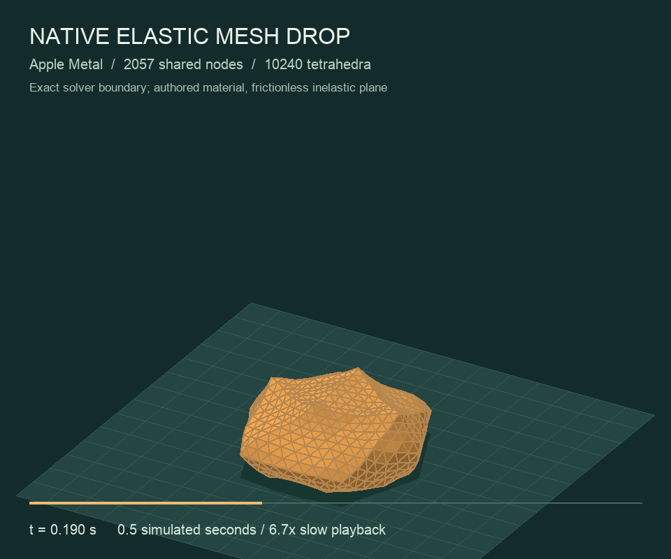
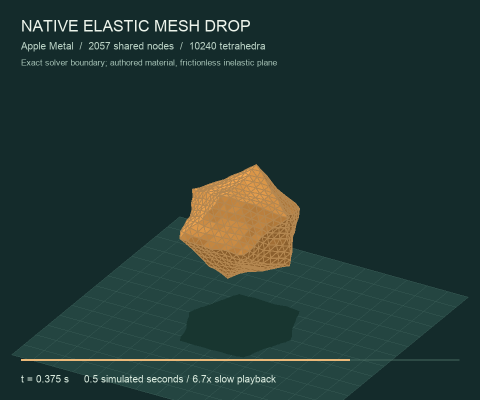

# Native shared-node elastic mesh drop

[](assets/deformable-support-10240.mp4)

The newest source-bound Apple Metal trajectory uses support-aware velocity Verlet on **2,057 shared nodes and 10,240 tetrahedra**. Its independent numerical energy bound is **0.846 percent** at 100 us, versus **144.949 percent** for the earlier Euler method at the same mesh and timestep. The half-timestep bound is 0.330 percent. These pass the authored 1 percent budget; physical material and whole-scene energy closure remain open.

The volume compresses from 85.065 to 47.809 mm and recovers to 70.599 mm through its own elastic stress. Two complete native replays match exactly, the half-timestep maximum nodal difference is 307.00 micrometres, and all six rejected candidates preserve accepted state and every ledger. The resting-support probe produces positive reaction impulse with exactly zero kinetic removal and position work. All 101 exported states pass independent geometry and mass checks.

The video retains the exact 1,280-triangle native boundary at 6.7x slow playback. [Full source, binary, states, video and energy receipt](assets/deformable-support-evidence.json), [owning nodal trace](assets/deformable-support-10240-trajectory.csv), [topology](assets/deformable-support-10240-topology.csv), and [independent geometry audit](assets/deformable-support-10240-geometry.json) bind this result to physics source `6973631`.

Spatial convergence remains **FAIL**: the new 1,280-to-10,240-element pair differs by up to 14.927 mm against the unchanged 1 mm target ([report](assets/deformable-support-10240-spatial.json)). The next level constructs 14,993 nodes, 81,920 tetrahedra and 5,120 surface triangles with independent topology checks. Its complete native replay, half-timestep and energy study is running; construction alone does not qualify runtime physics.

```sh
./build/numi-solver-deformable-mesh --mesh-refinement 3 --integrator support-verlet \
  --trajectory build/support-verlet-level3
python3 tools/audit_deformable_mesh_energy.py build/support-verlet-level3
```

## Historical Euler trajectory

[](assets/deformable-mesh-10240-drop.mp4)

This Apple Metal trajectory drops a nonlinear elastic volume onto the support
plane. Its 2,057 shared nodes and 10,240 tetrahedra own one set of positions, velocities,
and lumped masses. The surface is the exact 1,280-triangle boundary of those
elements. The renderer preserves that faceted geometry without sphere fitting,
smoothing, posing, or animation forces. The video plays 101 native states at
30 fps: 3.367 seconds of playback represent 0.5 simulated seconds.

| Before contact | Maximum captured compression | Later recovery |
| --- | --- | --- |
|  |  |  |

## Mechanics and contact

Each element evaluates the [qualified neo-Hookean constitutive law](DEFORMABLE_VOLUMES.md)
on its four owning node indices. Deterministic, sorted incidence lists gather
all elastic contributions at each node; no floating-point atomics are used.
Density is authored as `1000 kg/m³`, and each tetrahedron distributes one
quarter of its mass to each corner. The resulting total mass is `0.317019 kg`.
The authored coefficients are `mu=3000 Pa` and `lambda=6000 Pa`; they are not
measured fruit properties.

The force-integrated nodal velocities advance positions under gravity. A
predicted plane impact publishes `z=0` and zero incoming normal velocity,
with an impulse computed from that node's own mass and velocity change.
Tangential velocity is retained. This benchmark uses a frictionless inelastic
plane; stored elastic energy can subsequently lift nodes and recover shape.
It does not use a prescribed squash, rebound, center path, or bulk fruit pose.

Every complete candidate mesh is evaluated before acceptance. One inverted
element, invalid mass, malformed incidence list, or ABI failure rejects the
whole step. All accepted positions, velocities, and the support ledger remain
unchanged on rejection. Failure flags persist across every step, including
steps between captured states. A separate metallib preserves the running
cloth replay and the earlier independent-tetrahedron qualification artifacts.

## Refinement with the same authored body

Uniform eight-child tetrahedron refinement adds shared edge midpoints. It
preserves the original piecewise-flat surface, material coefficients, density,
and all pre-existing rest nodes. It does not project new nodes to a sphere.
Lumped masses and deterministic element incidence are rebuilt from the refined
volumes. Total mass changes by less than 28 micrograms from FP32 rest-coordinate
rounding. Each refinement retains a closed, outward-oriented surface and
exactly two opposing owners for every internal element face.

| Resolution | Owning nodes / tetrahedra / surface triangles | Minimum height | Final height | Maximum half-step nodal difference |
| --- | --- | ---: | ---: | ---: |
| Original | 13 / 20 / 20 | 50.89 mm | 77.63 mm | 59.70 µm |
| One refinement | 55 / 160 / 80 | 49.14 mm | 102.66 mm | 105.98 µm |
| Two refinements | 309 / 1,280 / 320 | 47.85 mm | 79.60 mm | 135.85 µm |
| Three refinements, newest video | 2,057 / 10,240 / 1,280 | 47.80 mm | 70.62 mm | 335.37 µm |

All four actual 0.5-second native simulations pass two exact replays, the
5,000-versus-10,000-step comparison, five whole-mesh rejection checks, zero
plane penetration, positive accepted element volumes, and the existing
momentum/energy-increase bounds. The new default-resolution run preserves all
101 original OBJ snapshots byte for byte. The finest run reaches a minimum
all-step volume ratio of 0.21475 and an accumulated plane impulse of 1.75183 Ns.
Its maximum vertical momentum discrepancy is 1.994 µNs. These are authored
frictionless-plane benchmarks, not calibrated fruit specimens.

Spatial convergence is still unresolved. At matched pre-existing nodes and
equal exported times, the 20-to-160-element comparison differs by up to
37.18 mm; the 160-to-1,280-element comparison differs by 36.39 mm. The latter
exceeds the explicit 1 mm spatial benchmark target and its audit returns FAIL.
Rebound shape and phase depend substantially on discretization despite passing
individual timestep checks. The [comparison report](assets/deformable-mesh-refinement-audit.json)
retains those results. Increasing element count does not erase this failure.

The new 1,280-to-10,240-element comparison differs by **14.996 mm** at matched
nodes, **4.733 mm** in center of mass and **10.070 mm** in height. Total mass
changes by 15.738 micrograms between these two resolutions. The independent
[spatial audit](assets/deformable-mesh-10240-spatial-audit.json) still returns
FAIL against the unchanged 1 mm target. Smaller discrepancy in this pair does
not establish spatial convergence.

[Newest native qualification log](assets/deformable-mesh-10240-drop-qualified.log),
[source, binary, state and video fingerprints](assets/deformable-mesh-10240-drop-evidence.json),
[complete nodal trace](assets/deformable-mesh-10240-drop-trajectory.csv),
[owning tetrahedra](assets/deformable-mesh-10240-drop-topology.csv), and
[independent trajectory audit](assets/deformable-mesh-10240-trajectory-audit.json).
The [previous 1,280-element video](assets/deformable-mesh-refined-drop.mp4) and
its source-bound record remain available.

## Construction and native regression

Construction builds incidence once per element and gathers by owning node;
the deterministic element/corner order remains byte-identical to the previous
full scan at all four resolutions. The
[CPU topology probe](assets/deformable-mesh-topology-3-evidence.json) passes
without occupying the GPU. A new complete level-2 native run on the M4 Pro
preserves all 101 previous M4 OBJ states, the CSV and topology byte for byte
([regression receipt](assets/deformable-mesh-level2-regression.json)).

The new level-3 trajectory was executed from source `78b0d46` in its isolated
Mini checkout. The terminal exit was zero after both 5,000-step replays,
10,000 half-timestep steps and all five transactional rejection checks.
The frozen source, executable and metallib manifest was verified after completion.

```sh
./build/numi-solver-deformable-mesh --topology-probe
./build/numi-solver-deformable-mesh --mesh-refinement 3 \
  --trajectory build/deformable-mesh-level-3
python3 tools/audit_deformable_mesh_trajectory.py build/deformable-mesh-level-3
# Both complete resolutions must exist. This comparison retains FAIL at 1 mm.
python3 tools/audit_deformable_mesh_refinement.py \
  build/deformable-mesh-level-2 build/deformable-mesh-level-3 \
  --output build/deformable-mesh-level2-3-audit.json
```

## Original 20-element M4 qualification

The [original coarse video](assets/deformable-mesh-drop.mp4) remains available.


[Native qualification log](assets/deformable-mesh-drop-qualified.log),
[source, binary, state and video fingerprints](assets/deformable-mesh-drop-evidence.json),
[nodal trace](assets/deformable-mesh-drop-trajectory.csv), and
[owning tetrahedra](assets/deformable-mesh-drop-topology.csv).

| Check | Result |
| --- | ---: |
| Native simulation / half-step refinement | 5,000 / 10,000 steps over 0.5 s |
| Two complete native replays | Exact positions, velocities, and ledgers at all 101 captures |
| Invalid candidates in either completed run or refinement | Zero |
| Mesh height: initial / minimum / final | 85.07 / 50.89 / 77.63 mm |
| Maximum relative nodal shape change | 24.75 mm |
| Maximum nodal difference under timestep refinement | 59.70 µm |
| Minimum volume ratio across every coarse step and element | 0.59891 |
| Plane penetration | Zero |
| Maximum net internal force, coarse run | 1.314 µN |
| Accumulated plane normal impulse, coarse run | 1.56416 Ns |
| Maximum vertical momentum-balance discrepancy | 4.175 µNs |
| Maximum sampled mechanical-energy increase above the initial state | Zero |
| Maximum elastic energy | 0.31223 J |
| Maximum pre-contact center-of-mass free-fall error | 0.345 µm |
| Invalid mass, inversion, node index, incidence alias, and ABI cases | Five whole-mesh rejection/ledger checks pass |

The independent artifact audit reconstructs all 20 element volumes and the
oriented boundary, verifies all 1,313 CSV rows against the 101 OBJ states,
and checks density-derived nodal mass. Replay and intermediate-step validity
come from the native execution and persistent device flags, not the exported
geometry alone.

The momentum check includes gravity and the accumulated external plane impulse.
The removed-normal-kinetic-energy ledger is `0.27941 J`; it is not total
contact-work closure, because projection also changes elastic and gravitational
potential energy. Sampled mechanical energy never exceeds its initial value.
That observation does not establish a complete energy-balance certificate.

```sh
cmake --build build --target numi-solver-deformable-mesh
./build/numi-solver-deformable-mesh --trajectory build/deformable-mesh-drop
ctest --test-dir build -R '^deformable_mesh.drop$' --output-on-failure
python3 tools/audit_deformable_mesh_trajectory.py build/deformable-mesh-drop
python3 tools/render_deformable_mesh.py build/deformable-mesh-drop build/deformable-mesh-renders
```

Rendering requires Pillow. These are three resolutions of one authored elastic
body on a flat plane. Mesh-resolution convergence, frictional surface contact,
finite-bench edges, measured fruit properties, and two-way contact with the
woven bag remain required before replacing the rigid fruit in the full scene.
The separate full bag timestep-refinement [knot failure](FRUIT_FALL.md#full-scene-half-timestep-qualification-remains-failed)
also remains open.

The newer [native energy accounting study](DEFORMABLE_ENERGY.md) measures
substantial integration defects and projection potential changes even when
the original energy-increase gate passes. The historical Euler 1 percent numerical budget is
not satisfied by the completed 100-to-1.5625 us level-2 study. Historical Euler
media remain bound to their original ABI-1 source. The newer support-Verlet
authored numerical budget passes; it does not qualify physical energy closure.
