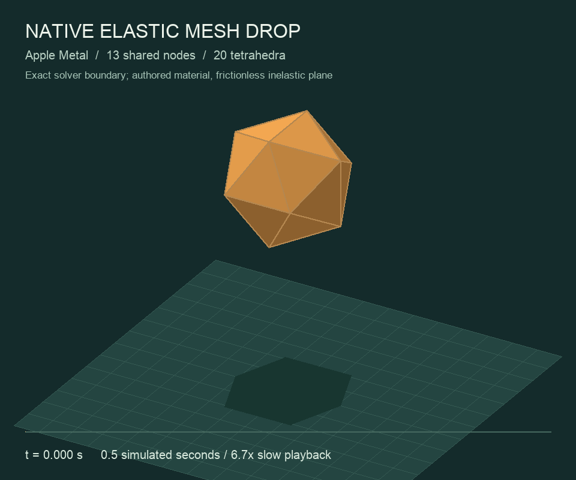
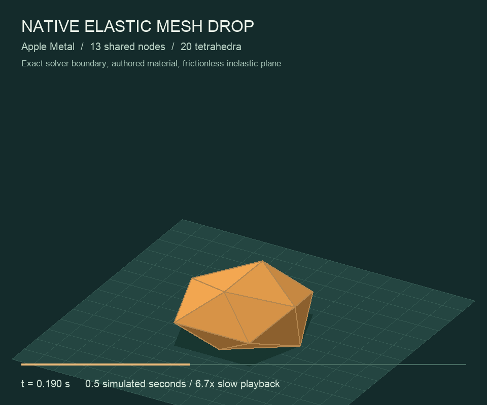
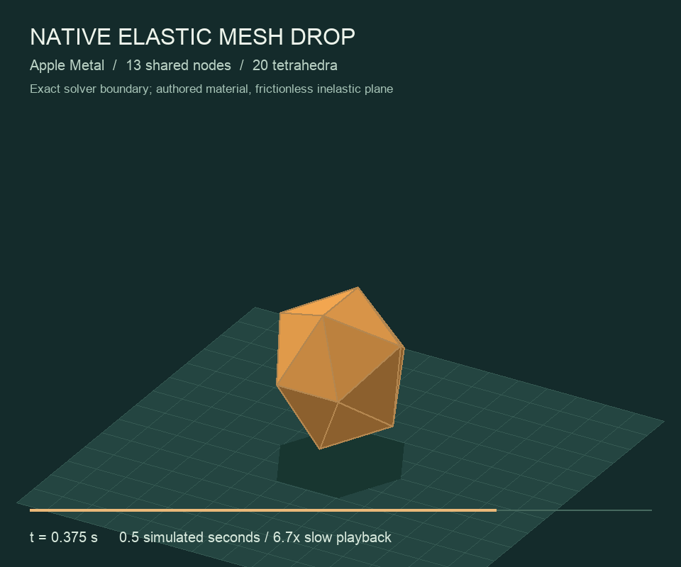

# Native shared-node elastic mesh drop

[](assets/deformable-mesh-drop.mp4)

This Apple Metal trajectory drops a nonlinear elastic volume onto the support
plane. Its 13 shared nodes and 20 tetrahedra own one set of positions, velocities,
and lumped masses. The surface is the exact 20-triangle boundary of those
elements. The renderer preserves that faceted geometry without sphere fitting,
smoothing, posing, or animation forces. The video plays 101 native states at
30 fps: 3.367 seconds of playback represent 0.5 simulated seconds.

| Before contact | Maximum captured compression | Later recovery |
| --- | --- | --- |
|  |  |  |

## Mechanics and contact

Each element evaluates the [qualified neo-Hookean constitutive law](DEFORMABLE_VOLUMES.md)
on its four owning node indices. Deterministic, sorted incidence lists gather
all elastic contributions at each node; no floating-point atomics are used.
Density is authored as `1000 kg/m³`, and each tetrahedron distributes one
quarter of its mass to each corner. The resulting total mass is `0.317019 kg`.
The authored coefficients are `mu=3000 Pa` and `lambda=6000 Pa`; they are not
measured fruit properties.

The force-integrated nodal velocities advance positions under gravity. A
predicted plane impact publishes `z=0` and zero incoming normal velocity,
with an impulse computed from that node's own mass and velocity change.
Tangential velocity is retained. This benchmark uses a frictionless inelastic
plane; stored elastic energy can subsequently lift nodes and recover shape.
It does not use a prescribed squash, rebound, center path, or bulk fruit pose.

Every complete candidate mesh is evaluated before acceptance. One inverted
element, invalid mass, malformed incidence list, or ABI failure rejects the
whole step. All accepted positions, velocities, and the support ledger remain
unchanged on rejection. Failure flags persist across every step, including
steps between captured states. A separate metallib preserves the running
cloth replay and the earlier independent-tetrahedron qualification artifacts.

## Measured M4 qualification

[Native qualification log](assets/deformable-mesh-drop-qualified.log),
[source, binary, state and video fingerprints](assets/deformable-mesh-drop-evidence.json),
[nodal trace](assets/deformable-mesh-drop-trajectory.csv), and
[owning tetrahedra](assets/deformable-mesh-drop-topology.csv).

| Check | Result |
| --- | ---: |
| Native simulation / half-step refinement | 5,000 / 10,000 steps over 0.5 s |
| Two complete native replays | Exact positions, velocities, and ledgers at all 101 captures |
| Invalid candidates in either completed run or refinement | Zero |
| Mesh height: initial / minimum / final | 85.07 / 50.89 / 77.63 mm |
| Maximum relative nodal shape change | 24.75 mm |
| Maximum nodal difference under timestep refinement | 59.70 µm |
| Minimum volume ratio across every coarse step and element | 0.59891 |
| Plane penetration | Zero |
| Maximum net internal force, coarse run | 1.314 µN |
| Accumulated plane normal impulse, coarse run | 1.56416 Ns |
| Maximum vertical momentum-balance discrepancy | 4.175 µNs |
| Maximum sampled mechanical-energy increase above the initial state | Zero |
| Maximum elastic energy | 0.31223 J |
| Maximum pre-contact center-of-mass free-fall error | 0.345 µm |
| Invalid mass, inversion, node index, incidence alias, and ABI cases | Five whole-mesh rejection/ledger checks pass |

The independent artifact audit reconstructs all 20 element volumes and the
oriented boundary, verifies all 1,313 CSV rows against the 101 OBJ states,
and checks density-derived nodal mass. Replay and intermediate-step validity
come from the native execution and persistent device flags, not the exported
geometry alone.

The momentum check includes gravity and the accumulated external plane impulse.
The removed-normal-kinetic-energy ledger is `0.27941 J`; it is not total
contact-work closure, because projection also changes elastic and gravitational
potential energy. Sampled mechanical energy never exceeds its initial value.
That observation does not establish a complete energy-balance certificate.

```sh
cmake --build build --target numi-solver-deformable-mesh
./build/numi-solver-deformable-mesh --trajectory build/deformable-mesh-drop
ctest --test-dir build -R '^deformable_mesh.drop$' --output-on-failure
python3 tools/audit_deformable_mesh_trajectory.py build/deformable-mesh-drop
python3 tools/render_deformable_mesh.py build/deformable-mesh-drop build/deformable-mesh-renders
```

Rendering requires Pillow. This is one coarse authored elastic body and a
flat plane. Mesh-resolution convergence, frictional surface contact,
finite-bench edges, measured fruit properties, and two-way contact with the
woven bag remain required before replacing the rigid fruit in the full scene.
The separate full bag timestep-refinement [knot failure](FRUIT_FALL.md#full-scene-half-timestep-qualification-remains-failed)
also remains open.
