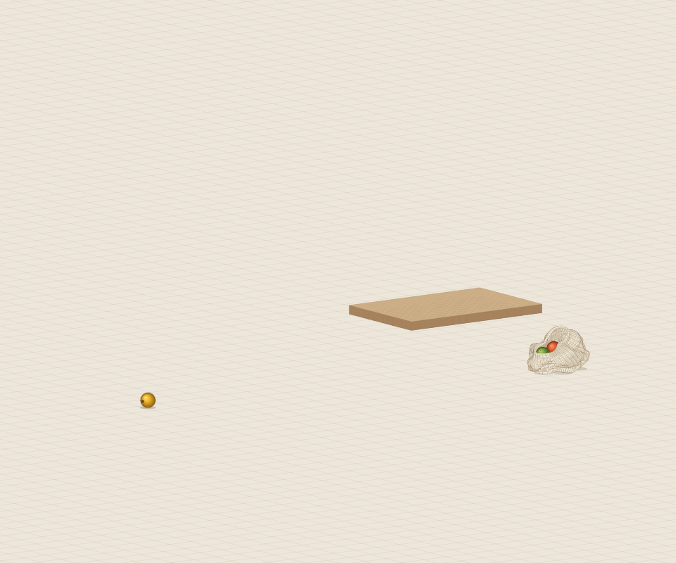
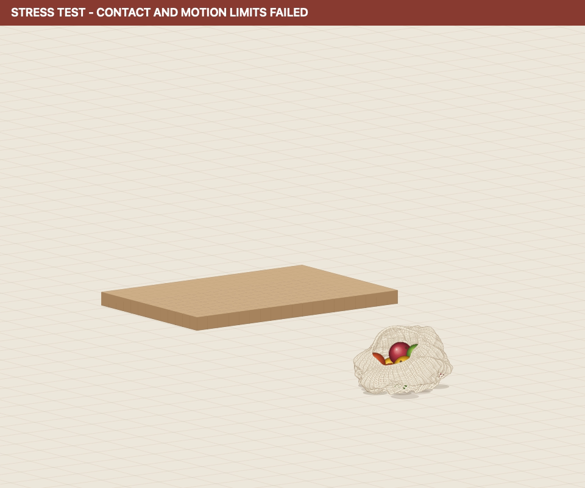

# Six-second loaded-bag drop

[](assets/finite-bench-loaded-drop-repaired.mp4)

## Newest complete authored-case result: PASS

The repaired `6f1e450` CPU FP64 simulation completes both full six-second runs
with actual exit 0. It keeps the same 121-pose grip input, 48 substeps,
32 iterations, material and acceptance limits. The cloth is carried, turned
180 degrees and released at 3.8 seconds. After the first saved inactive-grip
state, its mass center descends **1.717 m**; the first saved floor contact is
at **4.417 s**, and **28 cloth nodes** finish against the lower floor.
Fruits 10 and 11 spill and both finish at their floor radii with zero vertical
velocity. Both complete 721-frame fruit sequences match exactly.

All **73** exported states independently pass fruit, local node, nonlocal yarn,
and whole-yarn/static contact checks. The unchanged solver gates pass too:
maximum speed is **16.16 m/s**, and published ground penetration, strain-limit
violation and ground correction are zero to log precision. The final physical
hash is `0xc5d60d0e3ab5a9ba`; the ordered 721-frame digest is `0xe9b999601b9d16e2`.

[Terminal log](assets/finite-bench-loaded-drop-repaired.log),
[complete independent audit](assets/finite-bench-loaded-drop-repaired-audit.json),
and [source, binary, state and video fingerprints](assets/finite-bench-loaded-drop-repaired-evidence.json).
The video shows all 73 states with one fixed camera at 12 fps. Sphere collision
geometry remains rigid; authored cloth/sphere gates do not establish material
calibration, temporal convergence, native finite-bench execution, measured
support reactions or full contact-work/energy closure.

## Retained original failure


[](assets/finite-bench-loaded-drop-diagnostic.mp4)

**Diagnostic replay: contact, strain and motion gates fail.**
The video shows the complete six-second dynamic trajectory with a fixed camera.

This synthetic stress input increases the scene beyond fruit falling from a
held bag. The loaded deformable bag is carried past the finite tabletop edge,
the compliant seam grip turns 180 degrees, and the grip releases at 3.8 s.
Gravity then advances the freely moving cloth and twelve rigid fruit toward
the lower floor, with 2.2 seconds remaining for impact and settling. The grip
turn is not a prescribed rotation of the whole bag. No cloth or fruit path is
posed, no fruit is given a release impulse, and no re-grab is requested.

The authored scene retains 1,465 dynamic cloth nodes, 2,904 yarn segments,
5,754 local node contacts, twelve sphere fruits, 0.07805 kg cloth and 2.33 kg
fruit. The finite slab is 1.5 by 1.0 m, 80 mm thick, with top at z=0 and the
room floor at z=-0.75 m. Material, gravity, friction, rolling resistance,
contact thickness, compliance and acceptance gates are unchanged.

## Authored seam motion

The [121-pose CSV](../calibration/trajectories/finite-bench-loaded-drop.csv)
uses the version 3 relative-pose contract. A cubic smoothstep is sampled at
50 ms intervals; the runtime interpolates translation and unit quaternions.
All translations are relative to the authored cuff handle, in metres.

| Time | Input |
| --- | --- |
| 0 s | Attached, zero translation, identity rotation |
| 0–1.2 s | Lift the seam by 1.2 m |
| 1.2–1.6 s | Hold |
| 1.6–3.0 s | Carry 1.1 m in +x, beyond the tabletop edge |
| 1.6–3.2 s | Turn the grip 180 degrees about the world y axis |
| 3.2–3.8 s | Hold the final pose |
| 3.8–6.0 s | Grip inactive; cloth and fruit continue dynamically |

```sh
./build/numi-solver-cloth-bag --scenario recorded --finite-bench \
  --grip-trajectory calibration/trajectories/finite-bench-loaded-drop.csv \
  --steps 720 --substeps 48 --iterations 32 --replays 2 \
  --dump-frames build/loaded-drop --dump-every 10 \
  --dump-obj build/loaded-drop-final.obj \
  --dump-knot-peak build/loaded-drop-peak.obj \
  --knot-trace build/loaded-drop-knot.csv \
  --fruit-trace build/loaded-drop-fruits.csv \
  --contact-peak-prefix build/loaded-drop
python3 tools/audit_cloth_snapshot.py build/loaded-drop-*.obj \
  --include-local-node-contacts --include-yarn-static-contacts --require-finite-bench
python3 tools/audit_loaded_cloth_drop.py build/loaded-drop \
  --output build/loaded-drop-outcome.json
```

## Evidence status and required outcomes

The trajectory parses through the production loader and a two-frame startup
passes two exact replays, including its three accepted frame-state hashes.
That is only input/startup validation. The original six-second CPU48 job from
frozen source `4186cfa` completed both 720-frame replays with actual exit 1:
**FAIL**. Final hash `0xae84f235fdd073fe` and the ordered digest
`0xb0c91802bd8bc27a` of all 721 accepted frame states match in both runs.
The independent audit also matches both complete fruit sequences.
The complete input fingerprint is SHA-256
`1313ab661da38fe49c764209391e489050aef5e35399230561d3be7a8c62afd1`.

After the 3.8 s grip release, all saved grips remain inactive. Cloth COM falls
1.739 m from the first post-release snapshot at 3.833 s to the final state.
The first saved cloth/floor contact is at 4.417 s, and 38 cloth nodes end at
the 4 mm floor support height. All 73 saved yarn interiors clear the bench and
floor, but 14 saved states fail the fruit/yarn contact audit. Across every
accepted frame, fruit/yarn overlap reaches 442.8 um and strain-limit residual
65.4 um, both above the unchanged 2 um limits. The 6.115 mm maximum ground
correction exceeds 4.001 mm, and peak dynamic speed 42.61 m/s exceeds 30 m/s.
The geometric drop outcome passes; full physical qualification does not.
[Terminal log](assets/finite-bench-loaded-drop-48.log),
[complete independent audit](assets/finite-bench-loaded-drop-48-audit.json), and
[source-bound failure receipt](assets/finite-bench-loaded-drop-48-evidence.json)
retain these results. A fresh full run from `6f1e450`, using the support-aware response and
blocked-load friction repair, is running from frozen source and binary.

Whole-scene physical gates, the ordered hash of every accepted frame, all
73 exported contact audits and the final inactive grip must pass. The loaded
drop outcome additionally needs measured cloth COM descent after release and
actual lower-floor cloth contact. The independent loaded-drop auditor rejects
incomplete runs, checks both full fruit sequences, reconstructs all 73 saved
contact states including yarn interiors, and computes cloth COM with the
ordinary/hem mass distribution. It requires every saved post-release grip to
be inactive, at least 100 mm of COM descent from the first post-release saved
state, and lower-floor cloth contact including the final saved state. These are
geometric outcomes, not measured support reactions or impact velocities. A solver PASS without that outcome is not a
qualified loaded-bag drop. Saved cloth states and all 721 per-fruit frame
states in both replays supply the witnesses. Report collisions, folding,
re-entry and any failed gate from the actual run; do not replace them with
posed deformation or a shortened execution.

This remains an authored woven-cloth/sphere model. The native elastic volume
benchmark is separate, and its mesh-resolution convergence is still open.
Replacing sphere fruit with deformable volumes requires reciprocal surface
contact and cloth/volume coupling. Native finite-bench execution, calibrated
specimens and full contact-work/energy closure remain open.
