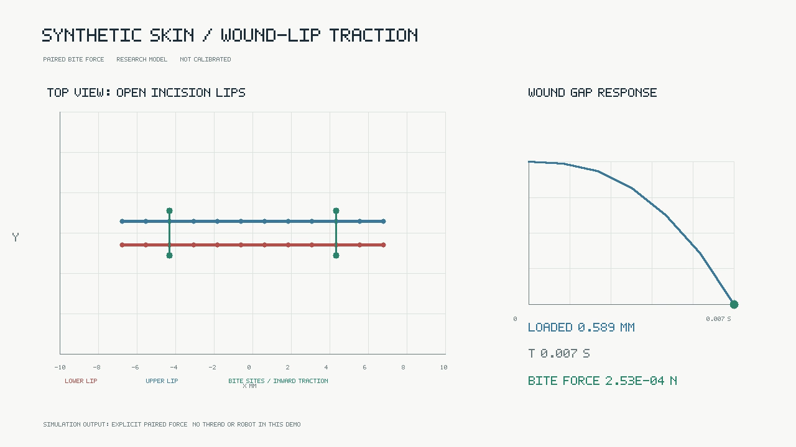

# Trace-guided synthetic wound-lip traction

**Result: seven accepted diagnostic states; preregistered volume target missed.**
This is a short native-solver result on one synthetic coupon, not wound closure,
tissue calibration, a physical procedure, or clinical evidence.

## Video

The video contains the seven saved states from steps 0 through 6 at 1 fps. It
uses geometry from the run without interpolation or deformation exaggeration.
The 60-step protocol horizon and the seven-step execution window are labeled
separately in the clip.

## Prediction and result

The prior per-column trace showed that the 20-column FGMRES budget was not
binding. A single follow-up candidate changed only the scheduled inexact-solve
forcing amplitude, from `0.0625` to `0.015625` (active target `0.03125` to
`0.0078125` at Newton iteration 1). Newton remained at 7; FGMRES remained at
20; the mesh, material, initial state, load schedule, time step, and every
acceptance gate were held fixed. The preregistered target was a maximum mixed
volume residual of `5e-5` by step 6.

The seven-step run completed with code 0. Its maximum mixed-volume residual was
`8.59546635e-5`: it passed the unchanged `1e-4` gate but **missed** the stricter
`5e-5` prediction. Mean lip gap moved from `0.600000028` mm to `0.588743268`
mm, a reduction of `11.2568` µm or `1.8761%`. Maximum displacement was
`8.8251` µm; minimum determinant was `0.999600232`; maximum equilibrium and
pressure residuals were `3.3993e-6`; mass relative error was `6.23e-8`; all
2,304 tetrahedra remained active. At the final saved step the bite force was
`0.253012` mN per site, compared with the planned `10` mN endpoint.

The preregistered target was not achieved. The clip is a seven-step traction
prefix, not a full 60-step run and does not show wound closure. The retained
FGMRES values are least-squares residual estimates, not independently
recomputed true residuals. The same-setting trace capture is instrumentation
replay of the candidate, not an independent replicate. No timing is used as
isolated performance evidence: another Metal workload was active on the shared
Mac mini during these runs.

## Reproduction record

- Registered question, prediction, and stop rule: [`metadata/trace-guided-candidate-plan.md`](metadata/trace-guided-candidate-plan.md).
- Exact command and recorded input hashes: [`metadata/trace-guided-run-command.txt`](metadata/trace-guided-run-command.txt) and [`metadata/input-manifest.txt`](metadata/input-manifest.txt).
- Successful seven-step candidate logs and samples: [`output/candidate/`](output/candidate/).
- Same-settings instrumented replay, per-column trace, trace summary, and terminal status: [`output/trace-reproduction/`](output/trace-reproduction/).
- Trace summary: 16,035 records written, capacity 32,768, no overflow. At step 6, 256 microticks used 10 Krylov columns each; final relative least-squares estimates ranged from `0.013206` to `0.019549`, above the stricter `0.0078125` forcing target. The final nonlinear certificate nevertheless passed the unchanged volume gate.
- Source snapshots and the exact instrumentation/policy patch: [`source/`](source/).
- Deterministic renderer and exact command: [`render/`](render/).
- Host: Apple M4 Pro Mac mini. Base source commit: `eed22b54e93db18ff8d2bf36b5c454a52efdab79`.
- Trace-reproduction executable SHA-256: `a30dee4c3714b71b357a9b45beb4bddc2161f635d15578a00852cf0e08c26c76` (the candidate executable was rebuilt only to make the same-setting instrumentation replay flush traces on success; no solver policy or numerical input changed).
- Metallib SHA-256: `3919a27db155d54ca54c3e6622172decec5b3dfd26dad2088b044d496165648a`.
- Material SHA-256: `379945f593f12396b44c7148026f0250344a86278e01b7b26cb5f6d823a51e35`.
- Video SHA-256: `f6372b5eb0bbcc5b9361fac3b583602e470ab20c83fb121fa8a2cc94a16b4a16`.
- Poster SHA-256: `ed7784808b855e3f941ed871444ec360b938d87bc658a5a4b2d9e68cae1eace8`.
- [`SHA256SUMS`](SHA256SUMS) covers this archive.

There is no measured skin fit, needle passage, suture thread, Franka arm,
healing, or clinical qualification in this result. The earlier rejected states
and solver-sensitivity runs remain preserved in the parent archive.
